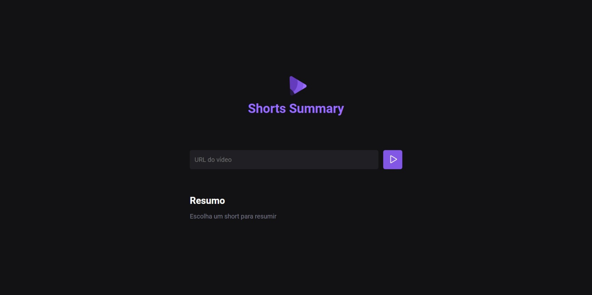

# NLW IA - Shorts Summary
Developed at @Rocketseat's NLW IA event!
## Table of contents

- [Overview](#overview)
  - [The challenge](#the-challenge)
  - [Screenshot](#screenshot)
  - [Links](#links)
- [My process](#my-process)
  - [Built with](#built-with)
- [Author](#author)

## Overview

### The challenge

Shorts Summary is a web application to create a summary of short YouTube videos using Artificial Intelligence to transcribe the video content and summarize the content. This project is developed on the FOUNDATIONS track in the NLW IA edition.

### Screenshot

### Links

- Solution URL: [https://github.com/jefferson-gbarbosa/nlwia-foundations](https://github.com/jefferson-gbarbosa/nlwia-foundations)

## My process

### Built with

- Semantic HTML5 markup
- CSS custom properties
- NodeJs
- ChatGpt
- Axios

## Author

- Linkedin - [jefferson-gbarbosa](https://www.linkedin.com/in/jefferson-gbarbosa/)
- GitHub - [https://github.com/jefferson-gbarbosa](https://github.com/jefferson-gbarbosa)
- Twitter - [@JeffGoncalves42](https://twitter.com/JeffGoncalves42)

